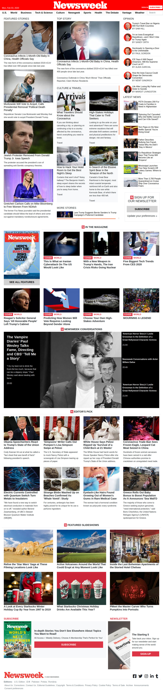

# Using-Bootstrap

> This is the Seventh project of the Microverse HTML Course.

Using CSS Preprocessors to Save Time replicating the landing page of [NewsWeek](https://www.newsweek.com)

## Built With

- HTML,
- CSS,

## GitHub Repo

- https://github.com/Salvador-ON/Using-Bootstap

## Live Demo

- [Demo](https://rawcdn.githack.com/Salvador-ON/Using-Bootstap/978936630ae1dbe62cce76236b87065f1e6d75f4/index.html)

## Author

👤 **Salvador Olvera Nava**

- Github: [@Salvador-ON](https://github.com/Salvador-ON)
- Twitter: [@Salvador_ON](https://twitter.com/Salvador_ON)
- Linkedin: [Salvador Olvera](https://www.linkedin.com/in/salvador-olvera-n)

## Show your support

Give a ⭐️ if you like this project!

## 📝 License

Distributed under the MIT License. See `LICENSE` for more information.
